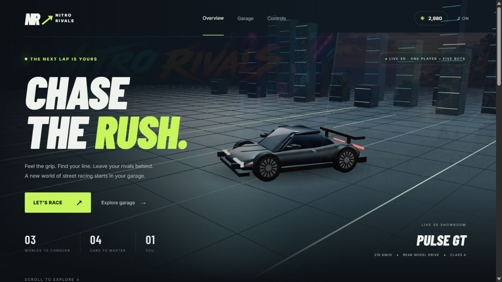
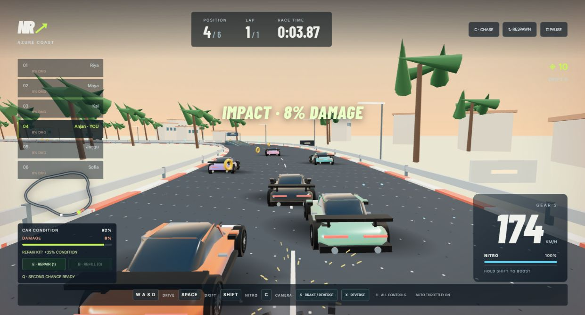
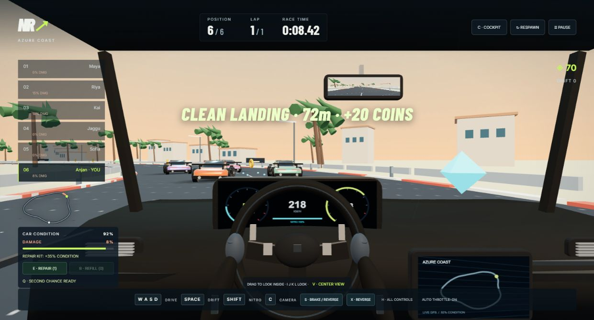
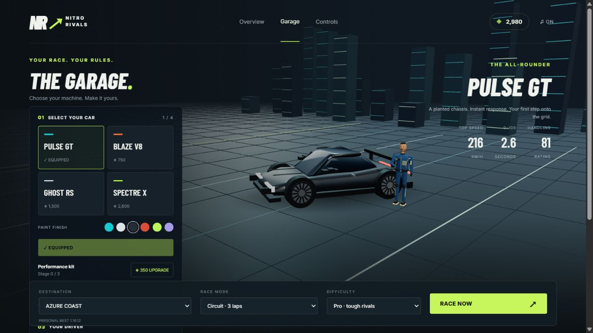
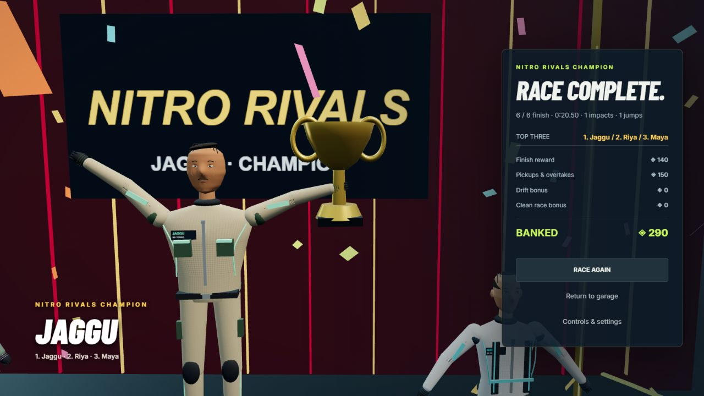
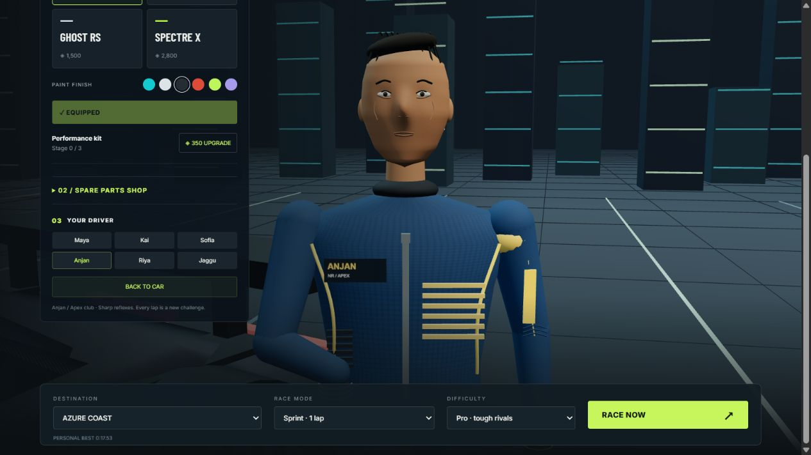

# Nitro Rivals 🏁

**Chase the rush. Race five rivals. Own the finish line.**

A playable 3D arcade racing game in your browser: three worlds, four cars, six drivers, nitro boosts, road jumps, and a working cockpit view.

[**▶ Play now — no install required**](https://nitro-rivals.vercel.app/) · [**Download the game**](https://github.com/codexanjan/nitrorivalsracinggame/releases/latest) · [Report a bug](https://github.com/codexanjan/nitrorivalsracinggame/issues)

[](https://nitro-rivals.vercel.app/)

## Get onto the grid

1. Open the [live game](https://nitro-rivals.vercel.app/) and choose **Garage**.
2. Pick your driver, car, destination, mode, and difficulty.
3. Hit **Race Now**. Use **WASD / arrows**, **Shift** for nitro, and **Space** to drift.

Start with **Rookie** if you are learning. **Pro** is the default: rivals plan overtakes and time their boosts. Click a game control to enable sound.

## What makes the race

- **One human + five bots:** all racers use the same car performance, upgrade limits, damage rules, and jump physics. Difficulty changes driving decisions.
- **Nitro with a tradeoff:** luminous exhaust jets, particle trails, boost heat, drafting, and drifting to refill boost.
- **Orange jump ramps:** launch at speed, clear other cars when airborne, and earn 20 coins for a clean landing.
- **Solid car collisions:** rotated car bounds, separation at walls, and height checks for jumps. Crashes produce sparks, smoke, and debris.
- **Damage and recovery:** visible condition/damage percentages, repair pickups, spare kits, safe respawn, and one rewind per race.
- **Three camera views:** chase, hood, and cockpit with live instruments, gloves, GPS, rear-view mirror, and look-around.
- **Your garage:** unlock cars, change paint, install performance upgrades, and buy spare parts with earned game coins.
- **Champion ceremony:** a trophy-holding winner, red carpet, confetti, and the leading three racers with their names.
- **Original game audio:** synthesized music, engine layers, tire slides, nitro, coins, impacts, jumps, and a victory fanfare.
- **Saved progress:** wallet, purchases, settings, and personal bests persist in the current browser.

### Actual gameplay

| Race against five rivals | Inside the cockpit |
| --- | --- |
|  |  |

| Build your garage | Celebrate the champion |
| --- | --- |
|  |  |

These are screenshots of the playable game. The environment cards use separate concept artwork. Characters, cars, and racing environments use stylized procedural 3D graphics.

## Three worlds, three finish gates

| Location | Racing atmosphere |
| --- | --- |
| **Azure Coast** | Golden-hour skies, ocean straights, palm-lined bends, and a sunlit harbor |
| **Neon Harbor** | Night skyline, neon lights, tunnels, rain, and reduced road grip |
| **Frostvale Pass** | Snow peaks, pine forests, flurries, and a demanding alpine circuit |

**Sprint:** one lap against five bots. **Circuit:** three laps against five bots. **Time Trial:** three solo laps to improve your personal best.

## Choose your machine

| Car | Style | Base top speed | Unlock cost |
| --- | --- | --- | --- |
| **Pulse GT** | Balanced GT | 216 km/h | Starter car |
| **Blaze V8** | Muscle | 234 km/h | 750 coins |
| **Ghost RS** | Precision sport | 245 km/h | 1,500 coins |
| **Spectre X** | Hypercar | 270 km/h | 2,800 coins |

Speeds are game values before upgrades and boost. Coins are earned in-game; there are no real-money purchases.

### Six distinct drivers



| Driver | Character design |
| --- | --- |
| **Maya** | Coastal pro: white/cyan suit, ponytail, and carried helmet |
| **Kai** | Night endurance: dark suit, purple trim, and glasses |
| **Sofia** | Street leather: red jacket and flowing hair |
| **Anjan** | Apex club: blue bomber jacket, gold accents, and headband |
| **Riya** | Tech navigator: harness, cargo outfit, headset, and bob haircut |
| **Jaggu** | Rally veteran: cream/green gear, beard, and broader build |

### Spare parts

| Part | Cost | Effect |
| --- | --- | --- |
| Repair kit | 120 coins | Restore 35% condition during a race |
| Nitro canister | 90 coins | Refill 50% nitro |
| Sport tires | 450 coins | Permanent grip improvement for the selected car |
| Turbo assembly | 600 coins | Permanent acceleration and top-speed improvement |
| Impact bracing | 400 coins | Reduce impact damage by 20% |

## Controls

| Input | Action |
| --- | --- |
| **W / ↑** | Accelerate / drive forward |
| **S / ↓** | Brake; keep holding to reverse |
| **X** | Brake safely, then engage reverse |
| **A D / ← →** | Steer |
| **Space** | Drift / handbrake |
| **Shift** | Nitro boost |
| **C** | Cycle chase, hood, cockpit |
| **I J K L / drag** | Look around inside the cockpit |
| **V** | Center cockpit view |
| **R** | Safe respawn, +3 seconds |
| **Q** | Rewind once, +3 seconds |
| **E / B** | Use repair kit / nitro canister |
| **P / Esc** | Pause |
| **M** | Mute / unmute all audio |
| **F / H** | Fullscreen / all controls |

On-screen brake/reverse buttons work on desktop. Touch driving controls and optional auto throttle are included. Gamepad: left stick steering, RT accelerator, LT brake, A boost, X drift, Y rewind, Start pause. Controller mappings depend on browser/device support.

**Controls → Game music** switches music independently. **Performance** graphics and camera-shake settings are also available.

## Run locally

The game is a static site. Three.js is bundled locally; no build step or runtime package installation is needed.

```sh
git clone https://github.com/codexanjan/nitrorivalsracinggame.git
cd nitrorivalsracinggame
python -m http.server 8765
```

Open **http://localhost:8765/** in a modern browser with WebGL support. Serve through HTTP rather than opening `index.html` directly. Python 3 is needed for this example; any static HTTP server works. Optional Google Fonts need internet; system fonts are the fallback.

### Validate the racing systems

With Node.js 20 or later installed:

```sh
npm test
```

Seven regression suites cover all four cars, complete races on all three track geometries, packed collisions, pitched jump contacts, reverse, recovery, spare parts, save migration, equal bot performance, and exactly-once rewards. Rendering, audio, input, and responsive behavior also need browser checks.

## Deploy

**Production:** [nitro-rivals.vercel.app](https://nitro-rivals.vercel.app/)

For your own Vercel project, import this repository, select **Other** as the framework, leave the build command empty, and use `.` as the output directory. The included `vercel.json` defines the static site. Alternatively, run `vercel --prod` from the project root after linking your own project.

The included `render.yaml` also supports a Render static site with publish directory `.`. No server, database, API keys, or game account is required.

## Contribute and share

Found a glitch or have an idea? [Open an issue](https://github.com/codexanjan/nitrorivalsracinggame/issues/new/choose) or read [CONTRIBUTING.md](CONTRIBUTING.md).

Try this challenge: **win a Pro race on Azure Coast and share your finish time.** Include your car, upgrades, and mode so runs can be compared. If you enjoy the game, a GitHub star helps people discover it. Ready-to-use captions and screenshots are in the [sharing kit](docs/SHARING.md).

## Project notes

Built with JavaScript ES modules, Three.js, WebGL, and Web Audio. Simulation uses a fixed physics step with interpolated rendering. See [the code map](docs/ARCHITECTURE.md).

This is a single-player arcade game with AI rivals. Progress is local to the current browser and does not sync between devices. The project has no dedicated source-code license yet; visibility on GitHub alone does not grant redistribution rights. Bundled Three.js files retain their [MIT license](vendor/LICENSE).
